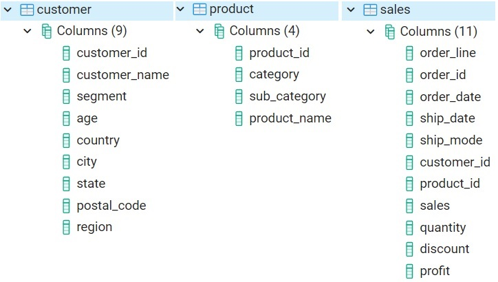
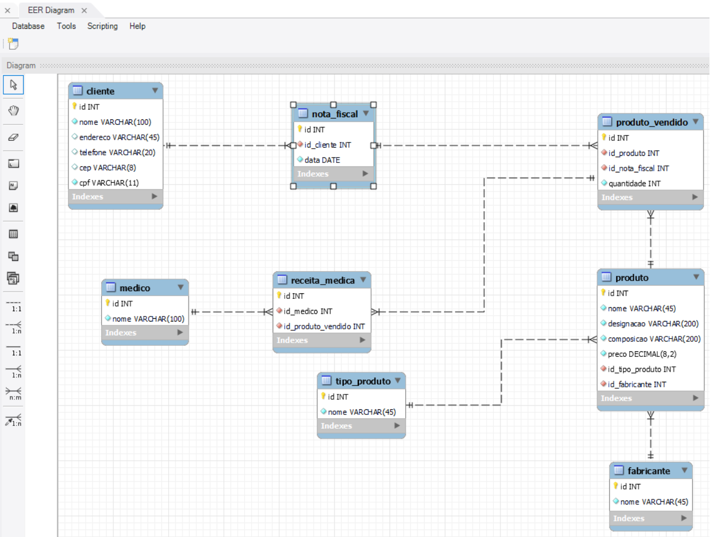

# Banco de Dados de um e-commerce

* ### Objetivo:

Criar perguntas (e READS que gerem as respostas) importantes com base no BD fornecido (este é um BD exemplo).

* ### Download e/ou visualização dos dados:

**SE VOCÊ DESEJA FAZER O DOWNLOAD DOS ARQUIVOS DE DADOS, ACESSE [AQUI](https://github.com/devmadruga/SQL/tree/main/e-commerce).**

**Se quiser acesso rápido aos dados do BD, veja: [customer.csv](https://github.com/devmadruga/SQL/blob/main/e-commerce/customer.csv), [product.csv](https://github.com/devmadruga/SQL/blob/main/e-commerce/product.csv) e [sales.csv](https://github.com/devmadruga/SQL/blob/main/e-commerce/sales.csv)**

* ### Um print das tabelas contidas neste BD:



* ### PERGUNTAS CRIADAS:
OBSERVAÇÃO: Respostas obtidas para PostgreSQL.

> "GERENTE DE MARKETING:"
Qual o número de clientes abaixo de 36 anos? Qual o número de clientes entre 36 e 54 anos? Qual o número de clientes acima de 54 anos?

```SQL
SELECT region, CASE WHEN age > 54 THEN 'Cat 3'
                    WHEN age < 36 then 'Cat 1'
                    ELSE 'Cat 2' END AS age_group, COUNT(*)
FROM customer GROUP BY region, age_group
ORDER BY region, COUNT DESC;
```


> GERENTE DE CADEIA DE SUPRIMENTOS:
Uma lista com os 5 produtos mais vendidos na East region.

```SQL
SELECT c.product_id, d.product_name, c.total_q_sold
FROM (SELECT e.product_id, SUM(e.quantity) AS total_q_sold
FROM (SELECT a.*, b.region
FROM sales AS a
LEFT JOIN customer AS b
ON a.customer_id=b.customer_id) AS e WHERE e.region = 'East' GROUP BY e.product_id) AS c
LEFT JOIN product AS d
ON c.product_id = d.product_id
ORDER BY total_q_sold DESC
LIMIT 5;
```

> GERENTE DE CADEIA DE SUPRIMENTOS:
Uma lista com os 5 produtos menos vendidos na South region.

```SQL
SELECT c.product_id, d.product_name, c.total_q_sold
FROM (SELECT s.product_id, SUM(s.quantity) AS total_q_sold
FROM (SELECT a.*, b.region
FROM sales AS a
LEFT JOIN customer AS b`
ON a.customer_id=b.customer_id) AS s WHERE s.region = 'South' GROUP BY s.product_id) AS c
LEFT JOIN product AS d
ON c.product_id = d.product_id
ORDER BY total_q_sold ASC
LIMIT 5;
```

> GERENTE FINANCEIRO:
Perda de receita total em função dos discontos.

```SQL
SELECT SUM(discount*sales) AS total_discount FROM sales;
```

> GERENTE FINANCEIRO:
Receita total e desconto para cada produto.

```SQL
SELECT product_id, SUM(discount*sales) AS discount, (SUM(sales) - SUM(discount*sales)) AS revenue, SUM(discount*sales)/(SUM(sales) - SUM(discount*sales)) AS ratio FROM sales
GROUP BY product_id
ORDER BY ratio DESC;
```

# Banco de Dados de uma farmácia.

* ### Simulação de um documento de modelagem entregue pelos Analistas de Sistemas:

Uma farmácia comercializa vários tipos de produtos (remédios, cosméticos, etc). Além do tipo, para cada produto são registrados o código, designação, composição, fabricança e preço de venda. Quando um cliente compra pela primeira vez na farmácia, são registrados os seus dados (nome, endereço, telefone, código postal, localidade e cpf). Depois de cadastrado, sempre que um cliente compra um determinado produto é registrado seu código de cliente, os produtos adquiridos, o nome do médico (no caso das receitas médicas), bem como o total da venda. Cada compra é identificada por um número para facilitar as consultas à base de dados.

* ### Objetivo:

ANALISAR ESTE DOCUMENTO, EXTRAIR AS ENTIDADES, CAMPOS, RELACIONAMENTOS E GERAR O MODELO DE ENTIDADE E RELACIONAMENTO.

Crei o modelo entidade relacionamento usando o MySQL Workbench:


